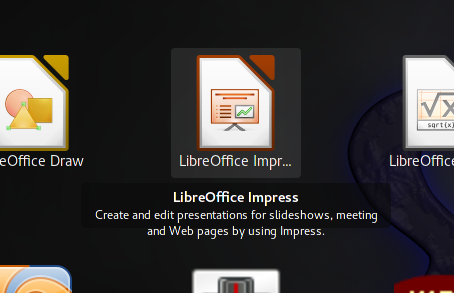

Applications overview tooltip
====================================

Gnome shell extension. Shows a tooltip over applications icons on applications overview.

Credits :
- 2012,2013 Original author Franco Bianconi
- 2014 Updated and upgraded by Karel Macha

By default the extension shows the application-description in the tooltip-label if provided. The description is the one from the .desktop file of the application. The tooltips are always displayed, even if the text under the icon in the app-overview is not cut-off/elipsized.

Those settings and some other can be adjuset in preferences dialog in the gnome-tweakutility or extensions.gnome.org.

## Known bugs:

* The tooltips do not work on anythin beside the application overview. I will try to implement the functionality also for dash.

The extension can behave buggy and the code is probably not the cleanest one, I am still a gnome-extension-noob.

